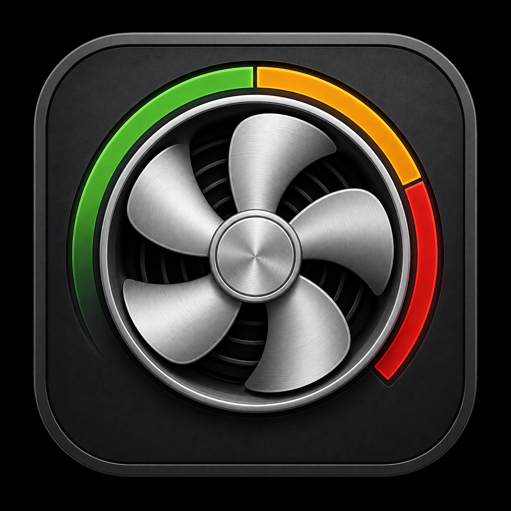
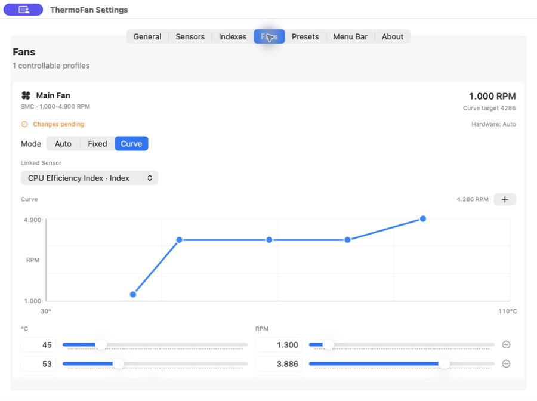
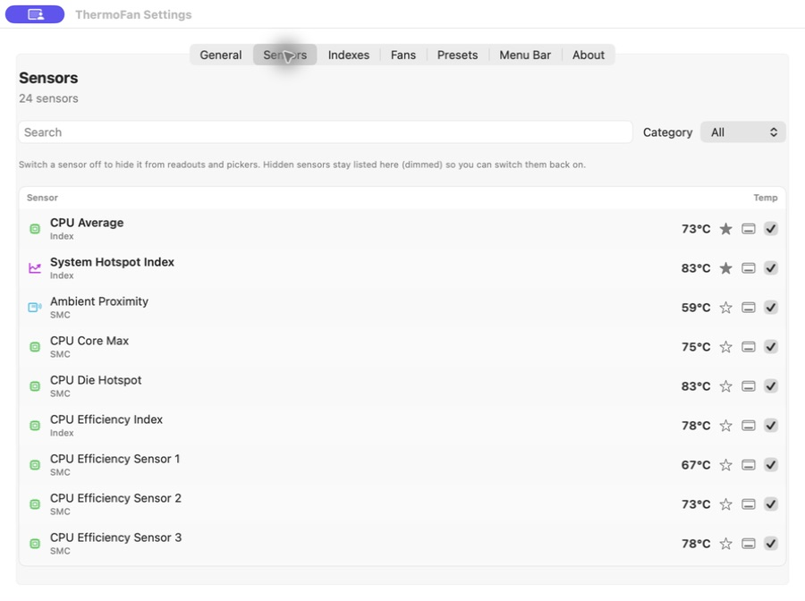
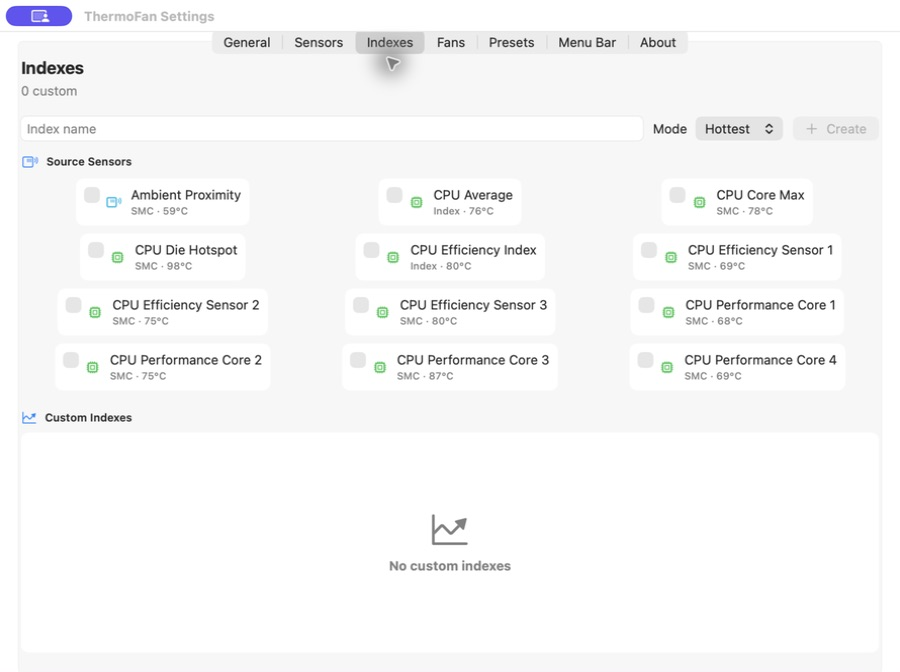
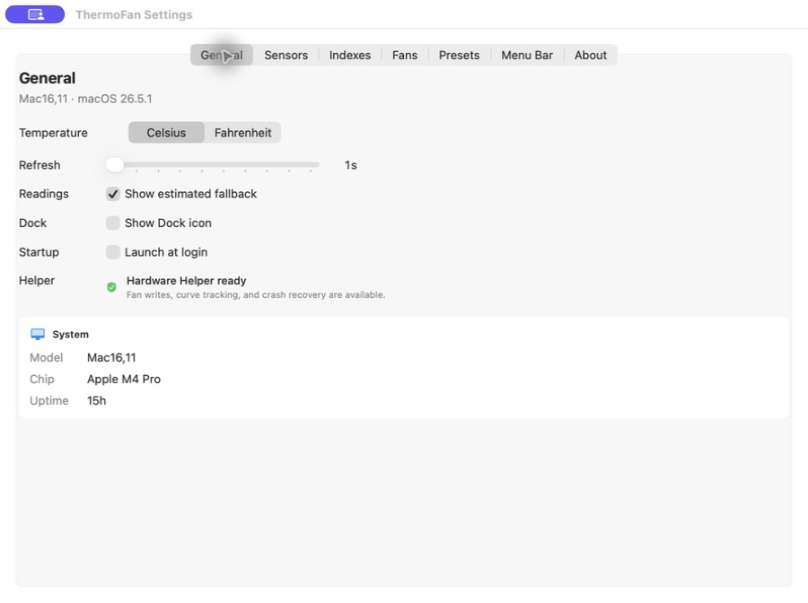

<div align="center">
  
  <h1>ThermoFan</h1>
  <p>A native macOS menu bar app for real thermal monitoring and verified fan control.</p>

  [](https://github.com/girginomer10/thermofan-macos/actions/workflows/ci.yml)
  [](https://support.apple.com/macos)
  [](https://www.swift.org)
  [](LICENSE)
</div>



ThermoFan reads available SMC and Apple PMU/HID temperature sensors, discovers
real fans, and lets you use automatic, fixed-RPM, or sensor-linked curve
control. Hardware changes are not reported as successful until the target and
mode have been read back from the SMC.

> [!WARNING]
> ThermoFan is experimental system software. Apple's SMC interfaces are private,
> vary by Mac model, and may change with macOS updates. Manual fan control can
> affect cooling, noise, component life, and system stability. Read
> [SAFETY.md](docs/SAFETY.md) before enabling fixed or curve control.

## Highlights

- Real SMC fan discovery with current, minimum, maximum, and target RPM
- Runtime detection of uppercase and lowercase Apple Silicon fan-mode keys
- Monitoring-only fallback when a firmware control surface is not verified
- Real SMC and Apple PMU/HID temperature readings
- Automatic, fixed-RPM, and temperature-curve fan modes
- Drag-editable curve graph with labeled temperature and RPM axes
- Direct numeric editing for every curve point
- Built-in CPU, GPU, and system hotspot indexes
- User-defined hottest-value or average indexes
- Stable sensor rows for intermittently sleeping SMC core keys, with stale
  values clearly marked as last readings
- Read-back verification after every hardware write
- One-time privileged helper installation instead of repeated password prompts
- Best-effort automatic-mode recovery on normal quit, crash, force-quit, and
  failed writes
- Presets, favorites, hidden sensors, menu bar selections, launch at login, and
  local persistence
- No analytics, telemetry, accounts, cloud sync, or background network requests

<p align="center">
  
  
</p>

<details>
  <summary>General settings and Hardware Helper status</summary>
  <br>
  
</details>

## Compatibility

| Item | Status |
| --- | --- |
| Minimum OS | macOS 14 |
| Distribution architecture | arm64 (Apple Silicon M-series) |
| Software capability coverage | M1-M5 fanless, one-fan, and two-fan firmware shapes |
| Current read-only validation | Mac16,11 with Apple M4 Pro |
| Validated OS | macOS 26.5.1 |
| Observed fan layout | One fan, 1,000-4,900 RPM; helper v8 write/watchdog acceptance pending |

Compatibility is intentionally stated narrowly. A successful build does not
prove that a new Mac exposes compatible writable SMC fan keys. See the
[M-series compatibility matrix](docs/COMPATIBILITY.md) and report verified models through the
[hardware compatibility issue form](https://github.com/girginomer10/thermofan-macos/issues/new?template=hardware_compatibility.yml).

## Build and Install

Requirements:

- macOS 14 or newer
- Xcode command line tools with Swift 6

```sh
git clone https://github.com/girginomer10/thermofan-macos.git
cd thermofan-macos
./scripts/build_app.sh
ditto dist/ThermoFan.app /Applications/ThermoFan.app
open /Applications/ThermoFan.app
```

The build script creates an arm64, Hardened Runtime app bundle with an ad-hoc
development signature at `dist/ThermoFan.app`. Current releases are source-only
and are not notarized. The guarded Developer ID/notarization workflow and its
remaining public-release gate are documented in
[Direct Distribution](docs/DISTRIBUTION.md).

On the first hardware-control attempt, ThermoFan asks for administrator
authorization once and installs:

```text
/Library/PrivilegedHelperTools/io.github.girginomer10.ThermoFan.helper
```

The helper is root-owned, narrowly accepts fan-control commands, clamps RPM to
the range reported by the SMC, and verifies mode and target writes. Helper v8
adds current M-series mode-key discovery, serialized writes, and a verified
pre-write crash-watchdog handshake. Older helper protocols must update before
another hardware write is allowed.

## Development

Run the app directly:

```sh
swift run ThermoFan
```

Run tests:

```sh
swift test
```

Build the distributable app bundle:

```sh
./scripts/build_app.sh
codesign --verify --deep --strict dist/ThermoFan.app
```

Read-only hardware diagnostics:

```sh
dist/ThermoFan.app/Contents/MacOS/ThermoFan --diagnose
```

Diagnostics report the Mac model, available sensors, fan ranges, and selected
raw SMC keys. They do not write fan settings. Review the output before posting
it publicly because hardware identifiers and temperature readings are included.

## How Fan Control Works

1. A UI change is staged and marked as pending.
2. `Apply to Hardware` installs or updates the helper if needed.
3. A privileged watchdog must confirm that it is already observing the app.
4. The helper reads the fan count and hardware RPM range.
5. It discovers the firmware's per-fan mode key; an unknown control surface is
   left read-only.
6. For fixed or curve mode, it enters manual mode, writes the target, and reads
   both values back.
7. A mismatch returns the fan to automatic mode and reports an error.
8. Curve mode recalculates the target from its linked sensor or index as
   temperatures change.

The helper runs only on the local Mac. Its command surface, installation model,
and trust boundaries are documented in [ARCHITECTURE.md](docs/ARCHITECTURE.md).

## Data and Privacy

Preferences are stored locally in:

```text
~/Library/Application Support/ThermoFan/state.json
```

ThermoFan does not collect or transmit sensor readings. The two links in the
About pane open this GitHub repository only when clicked.

## Uninstall

Quit ThermoFan, remove the app, and remove the privileged helper:

```sh
rm -rf /Applications/ThermoFan.app
sudo rm -f \
  /Library/PrivilegedHelperTools/io.github.girginomer10.ThermoFan.helper \
  /Library/PrivilegedHelperTools/io.github.girginomer10.ThermoFan.helper.version
```

To remove preferences too:

```sh
rm -rf "$HOME/Library/Application Support/ThermoFan"
```

## Project

- [Contributing](CONTRIBUTING.md)
- [Support and troubleshooting](SUPPORT.md)
- [Security policy](SECURITY.md)
- [Safety model](docs/SAFETY.md)
- [Architecture](docs/ARCHITECTURE.md)
- [Apple Silicon compatibility](docs/COMPATIBILITY.md)
- [Direct distribution](docs/DISTRIBUTION.md)
- [Changelog](CHANGELOG.md)

ThermoFan is released under the [MIT License](LICENSE).
